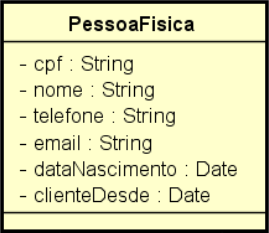
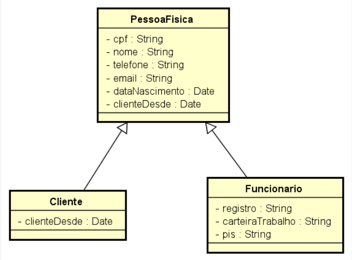
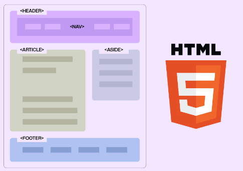
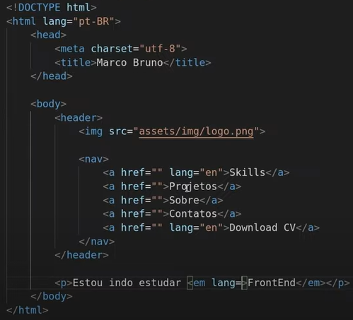

# Anotando...
## Conceito de java
Java é uma linguagem de programação orientada a objetos desenvolvida na década de 90 por uma equipe de programadores chefiada por James Gosling, na empresa Sun Microsystems, com o intuito de ser uma liguagem que seja interpreta em qualquer sistema operacinal, que em 2008 foi adquirido pela empresa Oracle Corporation.

## Orientada a Objetos
A sintaxe da linguagem Java é muito semelhante a da linguagem C ou de C++. Logo, o programador
que já conhece a linguagem C achará a transição para Java simples e fácil.
A sintaxe de Java fornece uma versão mais limpa do que C++. Em Java não existe aritmética de
ponteiros, estruturas, uniões e etc.

## Classes?
É a representação virtualizada de um item fisico que será usado com um molde para a criação de objetos com propriedade em comum.
>## Exemplo:
>
                             
## Herança?
É um tipo classe com atributos herdados de uma classe pai com o intuito de ser implementadas com novos atributos.

>## Exemplo:
>ação:

## encapsulamento e polimorfismo

># Front-End
# HTML
### O que é?
A Linguagem de Marcação de HiperTexto(HTML) éumo bloco de construção mais básico da web que define o significado e a estrutura do conteúdo da web como o esqueleto de um Site.

### SEO?
A otimização para mecanismos de busca é o conjunto de estratégias para potencializar e melhorar o posicionamento de um site nas páginas de resultados orgânicos, assim os algaritmos do google conseguem destacar melhor o seu site.  

### Elementos Semânticos
conseguem passar uma informação com um significado específico para o conteúdo interpretado pelo navegador, ou seja, é um beneficio se tratando do SEO,Ajuda leitores de tela, Cofigo mais limpo e compreensivl(Assim, facilitando a organização do codigo e facilita a manutenção).
    São elas: Header, Main, Footer entre outras.

>HEADER Representa o CABEÇALHO dos sites, onde conterá as logos, links entre outros.

>NAV Representa a area de NAVEGAÇÂO, aonde ficará os menus.

>ASIDE Representa uma caixa de CONTEUDO, que relacionado ou não ao conteudo do site.

>ARTICLE REpresenta o CONTEUDO PRINCIPAL de um site, como uma noticia ou UM topico de uma pergunta.

>SECTION Representa uma seção de um site, digamos que seja com paragrafos dentro que dividem um conteudo tipo um ponto final ou imagina uma loja da Renner onde contém varias SEÇÕES como masculino, femenino e infantil.

>FOOTER Como o proprio nome diz, é um RODA-PÉ de um site.

### Atributo Global
Atributos Globais são atributos comuns a todos elementos HTML; eles podem ser usados em todos os elementos, embora os atributos não tenham efeito em alguns elementos, como por exemplo "class, id, lang, style".

### Tags HTML

    <!DOCTYPE html>  - Indica a versão do HTML que está sendo usuado
    <html lang="pt">
        <head>
            <meta charset="UTF-8" />
            <meta http-equiv= x-ua-compatible content= ie=edge>
            <meta name= viewport content= width=device-width initial-scale=1.0>
            <title>Título do Documento</title>
        </head>
        <body>

        </body>
    </html>

>!DOCTYPE HTML : Indica a versão do HTML que está sendo usuado.

><> </> : Toda Tag que possue um conteudo terá que ser aberta e fechada.

>html lang="pt-BR" :Indica em qual linguagem o site será lido pelo navegador.

>head: guarda as METATAG que alteram o documento de forma inalterável vamos pensar como se fosse o cranio do site.

>meta charset="UTF-8": Define os tipos de caracteres que utlizamos.

>meta http-equiv= x-ua-compatible content= ie=edge: Melhora o funcionameno do INTERNET EXPLORE.

>meta name= viewport content= width=device-width initial-scale=1.0:Configura seu site para ser responsivel.

>title>Título do Documento/title>: Define o titulo da Pagina.

>body: Guarda as TAGS e todo o conteudo que serão impressas no site, imagina como se fosse o esqueleto do seu site.

>H1, H2, H3, H4, H5, H6: defina a hierarquia do tamanho do titulo do seu site.

>P: Define que seu conteudo seja interpretado pelo seu site como um PARAGRAFO.

>BR: utlizado para quebra linhas.

>HR: Utilizado para criar uma divisão no seu conteudo.

>OL: para criar listas   
>> LI: para colocar o conteudo de forma ordenada. 
>>
>>UL: para colocar o conteudo de forma NÂO ordenada. 

>a href=""> /a>: TAG Utilizada através de um texto para que possa navegar entre links.

>img src="link da img" alt="nomeclatura" width="500" height="600">: TAG usada para inserir imagens na pagina, e através de alguns parametros, podemos inserir uma nomeclatura para identificar a imagem ou padronizar um tamanho para sua imagem.

>video width="620" height="540" controls>
    >>src="movie.mp4" type="video/mp4">
>
>/video>: TAG Utilizada para reproduzir VIDEOS.

>audio controls>
    >>src="horse.mp3" type="audio/mpeg">
>
>/audio>: TAG Utilizada para reproduzir AUDIOS.

>table: TAG usada para criar tabelas, exemplo a abaixo.

    table>: Abre tabela
      tr>: abre um novo registro ou tupla
        th>Mês</th>: abre titulo das colunas
       th>Valor</th>: abre titulo das colunas
      /tr>
      tr>: abre um novo registro ou tupla
        td>Janeiro</td>: adiciona conteudo ao registro
        td>R$100</td>: adiciona conteudo ao registro
      /tr>
      tr>: abre um novo registro ou tupla
        td>Fevereiro</td>: adiciona conteudo ao registro
        td>R$80</td>: adiciona conteudo ao registro
      /tr>
    /table>: Fecha tabela

>form action="/action_page.php" method="get"> 
>
>/form>: Tag utlizado para tratar formulario. 
>
>Para utiliza-lo é preciso informar a proxima page e informar o METHOD que tem como opção GET usado mais para PAGINA ou Post Utilizado para SERVIDORES

>input: Campo para entrada de dados que usando o TYPE pode configurar esse campo para receber varios tipos de elementos de dados

    <input type="button">
    <input type="checkbox">
    <input type="color">
    <input type="date">
    <input type="datetime-local">
    <input type="email">
    <input type="file">
    <input type="hidden">
    <input type="image">
    <input type="month">
    <input type="number">
    <input type="password">
    <input type="radio">
    <input type="range">
    <input type="reset">
    <input type="search">
    <input type="submit">
    <input type="tel">
    <input type="text"> (Valor padrão)
    <input type="time">
    <input type="url">
    <input type="week

>A label tag define um rótulo para vários elementos de dados

    <label for="User">Usuário</label> 
    <input type="text" id="User" name="Name" />
    <label for="User">Senha</label> 
    <input type="password" id="User" name="Name" />

>button: tag define um botão clicável.

    <button> Acessar</button>

# JavaScript
## O que é?
é uma linguagem de programação interpretada estruturada, de script em alto nível com tipagem dinâmica fraca e multiparadigma (protótipos, orientado a objeto, imperativo e funcional).[2][3] Juntamente com HTML e CSS, o JavaScript é uma das três principais tecnologias da World Wide Web. JavaScript permite páginas da Web interativas e, portanto, é uma parte essencial dos aplicativos da web. A grande maioria dos sites usa, e todos os principais navegadores têm um mecanismo JavaScript dedicado para executá-lo.[4] É atualmente a principal linguagem para programação client-side em navegadores web. É também bastante utilizada do lado do servidor através de ambientes como o node.js.

## Java ou JavaScript?
Java é uma linguagem de programação OOP, ao passo que Java Script é uma linguagem de scripts OOP.
Java cria aplicações executadas em uma máquina virtual ou em um browser, ao passo que o código JavaScript é executado apenas em um browser.

## Linguagem funcional
é um paradigma (É a representação de um padrão a ser seguido) de programação que trata a computação como uma avaliação de funções matemáticas e que evita estados ou dados mutáveis.
### Funções Puras 

### Funções Impuras 

### Stateless (SEM ESTADO)
Trata das funções que ao ter uma variavel é definida, por mais que o valor seja definido sempre voltará oa estado inicial.

OU SEJA, essa função precisa atender 2 requisitos, tem que retornar sempre o mesmo valor se passar o mesmo parametro e não pode ter nenhum efeito colateral. 

### Immutable (IMUTAVEL)
Trata das funções que ao ter uma variavel é definida, o valor NUNCA poderá ser alterada, mas poderá ser copiado paa receber um novo valor.

## Funções de primeira classe e Funções de alta ordem
Uma linguagem tem funções de primeira classe, quando funções podem ser tratadas como valores que podem ser passados, manipulados, retornados... ou seja, é possível operar funções. Este conceito é um atributo da linguagem, ou ela tem ou não tem. Função de alta ordem é uma função que recebe ou retorna uma função.

## Sintaxe
### Regras e comandos JavaScript
No  JavaScript podemos ter varios tipos de conteudo como: textos, numeros, numeros decimais...

    Diferenças de Textos e Numeros

    Se colocarmos Aspas entre algum caractere o JS vai entender que esse valores são String
        por exemplo:
            console.log(5+5);   
        Como podemos ver não à aspas entre parenteses, tem dois numeros e caractere Aritimetico, ou seja, o JS identifica que é um calculo.

            console.log("5+5"); ou console.log('5+5');
        Já aqui podemos notar que Existem as aspas, ou seja, o JS entende que é uma String.

A linguagem foi desenvolvida para Case Sensivel, ou seja identifica quando o caractere é MAISCULA ou minuscula.
NO caso do JS foi desenvolvida o CaseCamel, uma forma de escrita que se assemelha muito ao desenho de uma camelo.
        
        por emxemplo:
        var PESSOA ='Dimitri'
        var pessoa ='Teixeira'

Por mais que seja a mesma palavra, JS entende como caracteres diferentes.

### principais tipos de variaveis

>var

    jkn

>let

    nvh

>const

    nvh

<!-- 
Habitos a se seguir:
se arrisque, realize desafios.

anote tudo que causa duvidas, pesquise a fundo e escreva um resumo.
ao travar se frustar, dê 30 min de pausa.
tudo que for fazer, faça por você, estude, trabalhe por você

-->

<!-- 
# Dicionario do Programador
## expressão Lambda

## expressão map

## expressão Filter

## Redux

##  Design Patterns 

-->